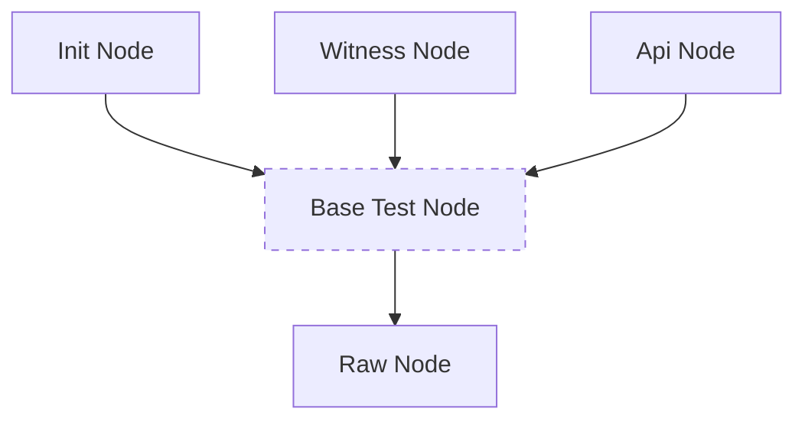

## Node types

When you are creating test case and defining nodes in network, you give them responsibilities. Purpose of first node in network is to sign blocks with some temporary witness, when normal witness nodes can't do it (because participation parameter is too low). When _init node_ sign enough blocks you can register additional witnesses in network. So then you create second node, which stores witnesses. Next you might want to create node, which doesn't contain any witness, but keeps tracking of blockchain state and handles api calls.

As you can see nodes have different use cases and needs to be configured properly for each of this tasks. TestTools provides support for most common types of nodes, which are described in details below.

### Short summary

| Node type                               | Purpose                            | Prepared<br>for blocks<br>generation | Enabled APIs                 | Shared<br>file size | Witness<br>plugin<br>enabled |
| --------------------------------------- | ---------------------------------- |:------------------------------------:|:----------------------------:|:-------------------:|:----------------------------:|
| Init node ([details](#init-node))       | Network start,<br>handle API calls | yes                                  | all                          | 128 MB              | yes                          |
| Witness node ([details](#witness-node)) | Sign blocks                        | no                                   | all                          | 128 MB              | yes                          |
| Api node ([details](#api-node))         | Handle api calls                   | no                                   | all                          | 128 MB              | no                           |
| Raw node ([details](#raw-node))         | _Unconfigured_                     | no                                   | account_by_key,<br>condenser | 54 GB               | yes                          |

### Base test node

Nodes are organized in a hierarchy. Init, witness and api nodes are nodes configured for tests. It is described in diagram below as base test node. You can't create this type of node. But all mentioned nodes have same behavior and extend it.



Every node extending base test node has:
- all APIs enabled
- reduced shared file size to 128 MB

### Init node

Most common type of node. Probably you will start each test case with _init node_ creation. This node provides blocks generation, so it makes network live. It allows you to add next nodes to network, use _cli wallet_ and send api calls.

```python
init_node = world.create_init_node()
init_node.run()

# With init node you can use wallet...
wallet = init_node.attach_wallet()
print(wallet.api.list_witnesses())

# ...and send api calls
init_node.api.database.list_witnesses(start=0, limit=100, order='by_name')
```

### Witness node

Node configured for containing witnesses and signing blocks. Requires prepared network with _init node_ to start signing blocks. Before you register any new witness make sure, that _init node_ has generated at least 33% of blocks in last 128 blocks slots. It must be simplified in some next TestTools version...

<details>
<summary>Code example</summary>

```python
# Define network
network = world.create_network()
init_node = network.create_init_node()
witness_node = network.create_witness_node(witnesses=['alice'])

network.run()

# Wait for 33% required participation (43 / 128 > 33%)
init_node.wait_for_block_with_number(43)

# Register witnesses
wallet = init_node.attach_wallet()
wallet.api.create_account('initminer', 'alice', '')
wallet.api.transfer_to_vesting('initminer', 'alice', '1000.000 TESTS')
wallet.api.update_witness(
    'alice', '', Account('alice').public_key,
    {"account_creation_fee": "3.000 TESTS", "maximum_block_size": 65536, "sbd_interest_rate": 0}
)
```

For working real life example check:
https://gitlab.syncad.com/hive/hive/-/blob/develop/tests/functional/python_tests/fork_tests/test_transaction_with_multiple_operations.py
</details>

### Api node

Responsibility of this node type is api calls handling.

<details>
<summary>Code example</summary>

```python
# Define network
network = world.create_network()
init_node = network.create_init_node()
api_node = network.create_api_node()
network.run()

# Send api calls
response = api_node.api.database.get_dynamic_global_properties()
print(response)
```
</details>

### Raw node

Node with default, unmodified configuration. Can be useful for tests which checks default behavior of node. Using this type of node is not recomended. Should be avoided and used only if any other can't meet the requirements. Every raw node creates 54 GB file for blocklog and has only few APIs included (it means additional code for including APIs in every test case).

If you want to check some default config value, use `create_default_config` function.
```python
from test_tools.node_configs.default import create_default_config
default_config = create_default_config()
assert default_config.required_participation == 33
```
