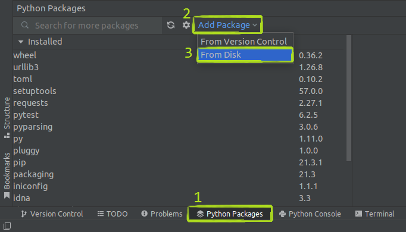
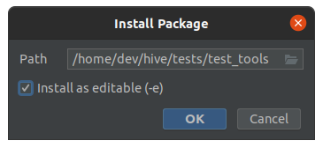
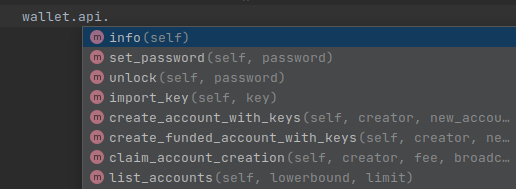

## Installation

To use TestTools you have to install them and specify location of hive executables. Whole process is described below.

### 1. Install package

Select one of following methods (click to expand):

<details>
<summary>Install with PyCharm</summary>

With opened project, select tab "Python Packages" at the bottom of window, click "Add Package" and then "From Disk".



Select TestTools directory, mark "Install as editable" option and click OK.


</details>

<details>
<summary>Install in virtual environment manually</summary>

```bash
cd ~/virtual_environments               # Select location for virtual environment
python3.8 -m venv venv                  # Create virtual environment in current directory
source venv/bin/activate                # Activate it
pip install -e ~/hive/tests/test_tools  # Install TestTools
```

To deactivate virtual environment run:
```bash
deactivate
```
</details>

<details>
<summary>Install in your operating system scope (not recommended)</summary>

Enter following command in terminal:
```bash
pip3 install -e ~/hive/tests/test_tools/
```
</details>

### 2. Define path to hive executables

Define environment variable `HIVE_BUILD_ROOT_PATH` with path to hive build directory (containing _hived_, _cli_wallet_ and other executables). Add entry `HIVE_BUILD_ROOT_PATH="/home/dev/hive/build"` to `/etc/environment` and restart computer.

<details>
<summary>If you don't want to modify content of your `/etc/environment` file...</summary>

...then you have to set this variable locally before every run of script, which uses TestTools. It can be done as in examples below:

```bash
HIVE_BUILD_ROOT_PATH="/home/dev/hive/build" pytest
HIVE_BUILD_ROOT_PATH="/home/dev/hive/build" python3 your_script.py
```

</details>

## Tutorials

- [Snapshot](documentation/tutorials/snapshot.md) -- What is snapshot? How to create and use it?
- [Replay](documentation/tutorials/replay.md) -- What is replay? How to do it?

## Features

### Easy testnet creation
You can run testnet with node configured for blocks production and attached wallet with such simple script:
```python
from test_tools import Wallet, World

if __name__ == '__main__':
    with World() as world:
        node = world.create_init_node()
        node.run()

        wallet = Wallet(attach_to=node)
```

### Node and wallet APIs
Node and wallet has `api` member which allows for communication with them. You can communicate with node and wallet with following syntax:
```python
# Example node calls
node.api.condenser.get_key_references(['TST5P8syqoj7itoDjbtDvCMCb5W3BNJtUjws9v7TDNZKqBLmp3pQW'])
node.api.database.list_witnesses(start=None, limit=100, order='by_name')

# Example wallet calls
wallet.api.create_account('initminer', 'john', '{}')
wallet.api.get_account('john')
```

Use your IDE's code completion to get hints for wallet api calls like below. IDE should help you to write method names, but also parameters.



### Node types
Creation and initialization of nodes are simplified by predefined node types. Node types hide a lot of configuration stage and make tests more readable, because node purpose is directly expressed in code ([read more](documentation/node_types.md)). Following node types are supported:
- init node,
- witness node,
- api node,
- raw node.

This is how network consisting of init, witness and api node can be defined:
```python
network = world.create_network()
init_node = network.create_init_node()
witness_node = network.create_witness_node(witnesses=[f'w{i}' for i in range(10)])
api_node = network.create_api_node()
```

### Node configuration
Node has `config` member which allow for editing _hived_ _config.ini_ file. You can configure node in following way:
```python
node.config.enable_stale_production = True
node.config.required_participation = 0
node.config.plugin.extend(['p2p', 'witness'])
```

> :warning: Type support is not completed yet. Not all config entries types are set correctly. At the moment most of them are treated as strings. So you have to write like:
> ```python
> # Note that all are strings
> node.config.market_history_bucket_size = '[15,60,300,3600,86400]'
> node.config.webserver_thread_pool_size = '32'
> node.config.witness_skip_enforce_bandwidth = '1'
> ```

Provides support for Python types. You can write:
```python
if node.config.enable_stale_production and node.config.required_participation < 20:
    ...
```
because type of `node.config.enable_stale_production` is `bool` and type of `node.config.required_participation` is `int`.

### Select which executables should library use
You can select them in python script, via command line arguments, environment variables or by executables installation ([read more](documentation/paths_to_executables.md)).

### Configure which files should be removed after test
During tests nodes generates a lot of files. In most cases some of these files are unneeded and are automatically removed by library. You can configure this behavior for your needs ([read more](documentation/clean_up_policies.md)).

### Generate public and private keys
Some tests requires multiple accounts creation. To perform operations on them keys are required. TestTools provides support for key generation with `Account` class. You only need to provide account name. Generated account contains member variables `private_key` and `public_key`, which can be used in tests. Optionally you can specify `secret` parameter, which affects generated keys.
```python
# Simple account creation example
account = Account('John')
print(account.private_key)  # Prints: 5KSJQHSBh4vxZVaY2fi3vbhDbkkg7C74pE4S3bigEQyct2RqMDf
print(account.public_key)   # Prints: TST8FukVPod6riKr2mg94hhDanCzCYvivJtPdpcUVnEChaJ5N9QbC

# Inline usage example
print(Account('initminer').private_key)  # Prints: 5JNHfZYKGaomSFvd4NUdQ9qMcEAC43kujbfjueTHpVapX1Kzq2n
```

If you need to create many accounts, (e.g. more than 10 000), it might be slow using method described above. For multiple accounts creation use method showed below:
```python
Account.create_multiple(100_000, 'example')  # Optimized version of: [Account('example-{i}') for i in range(100_000)]
```

### Send multiple operations in single wallet transaction
TestTools provides support for sending single transaction containing multiple operations. It is helpful for optimizing scripts which send multiple transactions and wait 3 seconds for every transaction confirmation. When sending these operations in one transaction, you wait for only one confirmation, so your script executes much faster. You can do it with following syntax:
```python
with wallet.in_single_transaction():
    wallet.api.create_account('initminer', account, '{}')
    wallet.api.transfer('initminer', account, amount, 'memo')
```
In above example operations `create_account` and `transfer` are sent in single transaction during exiting from "with" statement.

Implementation is very flexible and allows for using python control statements (ifs, loops), functions which sends wallet api calls and so on. See example below showing for-loop use case during transaction preparation.
```python
accounts_and_balances = {
    'first': Asset.Test(100),
    'second': Asset.Test(200),
    'third': Asset.Test(300),
}

with wallet.in_single_transaction():
    for account, amount in accounts_and_balances.items():
        wallet.api.create_account('initminer', account, '{}')
        wallet.api.transfer('initminer', account, amount, 'memo')
```

If you want to read response, you can name a returned context manager and call its `get_response` method after exiting `with` context, like this:
```python
with wallet.in_single_transaction() as transaction:
    ...

response = transaction.get_response()
```
